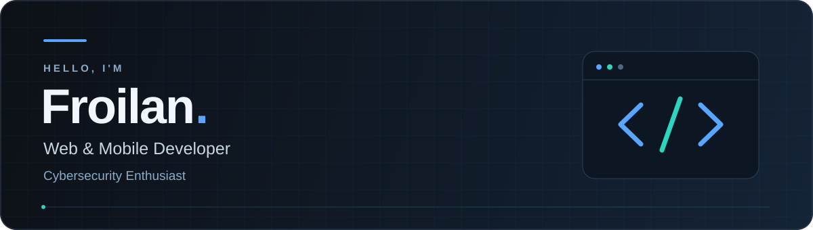

<!--
SETUP
Replace these values before publishing:
- YOUR_GITHUB_USERNAME
- YOUR_LINKEDIN_HANDLE
- YOUR_EMAIL_ADDRESS

Remove any contact link or technology that you do not want displayed.
The animated banner requires assets/profile-header.svg.
-->

  

  Building thoughtful digital experiences with security in mind.

  
  
  

  <a href="#about">About</a>
  &nbsp;·&nbsp;
  <a href="#toolbox">Toolbox</a>
  &nbsp;·&nbsp;
  <a href="#current-focus">Current Focus</a>
  &nbsp;·&nbsp;
  <a href="#connect">Connect</a>

---

## About

I'm **Froilan**, a web and mobile developer with an interest in cybersecurity.

I build full-stack web applications and cross-platform mobile experiences while exploring how to make software more secure, maintainable, and intuitive.

- **Web development** — responsive interfaces and full-stack applications.
- **Mobile development** — native Android and cross-platform experiences.
- **Cybersecurity** — CTFs, authorized testing, and secure-by-design practices.

> My goal: build useful software, understand how it works, and make it harder to break.

## Toolbox

### Web development

  
  &nbsp;
  
  &nbsp;
  
  &nbsp;
  
  &nbsp;
  
  &nbsp;
  
  &nbsp;
  
  &nbsp;
  
  &nbsp;
  

HTML · CSS · JavaScript · TypeScript · React · Vite · Node.js · Tailwind CSS · Bootstrap

### Mobile development

  
  &nbsp;
  
  &nbsp;
  
  &nbsp;
  

Android · Kotlin · Java · Jetpack Compose · React Native

### Security tools & environments

  
  
  
  
  

## Current Focus

- Building and refining full-stack web applications.
- Developing mobile apps for Android and cross-platform use.
- Practicing security testing in CTFs and authorized environments.
- Bringing secure coding practices into everyday development.

## Connect

Have a project to discuss, a technical question, or an idea worth exploring?

**[Email me](mailto:YOUR_EMAIL_ADDRESS)** or **[connect on LinkedIn](https://www.linkedin.com/in/YOUR_LINKEDIN_HANDLE/)**.

You can also browse my **[repositories](https://github.com/YOUR_GITHUB_USERNAME?tab=repositories)** to see what I’m working on.

---

  Froilan · Web · Mobile · Security

